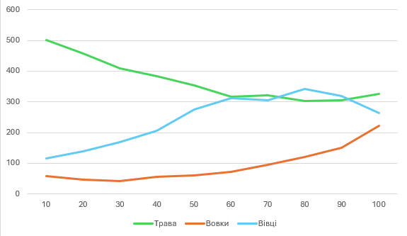
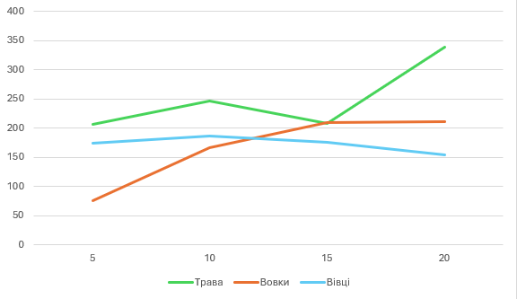
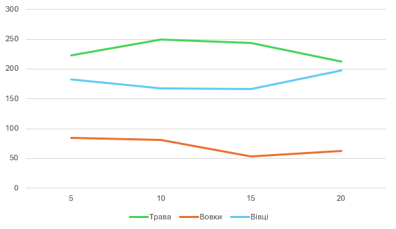

## Комп'ютерні системи імітаційного моделювання
## СПм-23-3, Соболь Олег Русланович
### Лабораторна робота №**1**. Опис імітаційних моделей та проведення обчислювальних експериментів

 

### Варіант 7, модель у середовищі NetLogo:
[Wolf Sheep Predation](http://www.netlogoweb.org/launch#http://www.netlogoweb.org/assets/modelslib/Sample%20Models/Biology/Wolf%20Sheep%20Predation.nlogo).

 

### Вербальний опис моделі:
Ця модель вивчає стабільність екосистеми типу хижак-жертва. Система вважається нестабільною, якщо має тенденцію призводити до зникнення одного чи більше видів. Навпаки, система є стабільною, якщо вона здатна підтримувати себе впродовж тривалого часу, попри коливання чисельності видів.

Модель має два варіанти.

Перший — "вівці-вовки", де тварини переміщуються, а вовки шукають овець для живлення. Кожен рух вовків потребує енергії, яку вони відновлюють, поїдаючи овець. Існує ймовірність розмноження для підтримання популяції. Вівці мають постійний доступ до їжі, але модель не враховує витрати енергії під час їх руху. Такий варіант є нестабільним і підходить для симуляції взаємодії видів у середовищі з високим вмістом поживних речовин.

Другий варіант — "вівці-вовки-трава", де додається трава як ресурс, яким харчуються вівці. Вівці гинуть без трави, яка з часом відростає. Цей варіант складніший, але стабільніший.

### Керуючі параметри:
- **model-version**. Визначає, що ми моделюємо: "овець, вовків і траву", чи просто "овець і вовків".
- **initial-number-sheep**. Визначає початкову популяцію овець у моделі.
- **initial-number-wolves**. Визначає початкову популяцію вовків у моделі.
- **grass-regrowth-time**. Скільки часу потрібно, щоб трава відростала після того, як її з’їли (Зверніть увагу, що це не використовується у версії моделі "вівці-вовки").
- **sheep-gain-from-food**. Кількість енергії, яку вівці отримують за кожну з’їдену одиницю трави (Зверніть увагу, що це не використовується у версії моделі "вівці-вовки").
- **wolf-gain-from-food**. Кількість енергії, яку отримують вовки за кожну з’їдену вівцю.
- **sheep-reproduce**. Визначає ймовірність, з якою вівці розмножуються під час кожного кроку симуляції.
- **wolf-reproduce**. Визначає ймовірність, з якою вовки розмножуються під час кожного кроку симуляції.
- **show-energy**. Визначає показувати чи ні енергію кожної тварини числом.

### Внутрішні параметри:
- **max-sheep**. Обмеження максимальної кількості популяції овець.
- **energy**. Енергія овець та вовків.
- **countdown**. Таймер відростання трави (модель "вівці-вовки-трава").

### Показники роботи системи:
- Кількість овець на полі.
- Кількість вовків на полі.
- Кількіссть трави на полі.
- Графік кількості овець вовків та трави.

### Примітки:
- За стабільних параметрів чисельність популяцій має схильність до передбачуваних коливань.
- У версії моделі "вівці-вовки-трава" за кожен крок овець також віднімається одна одиниця енергії.
- Кожен крок вовка зменшує його енергію на одну одиницю.
- Якщо всі вовки зникли, а кількість овець перевищує допустиму, модель припиняє роботу.
- За стабільних керуючих параметрів чисельність популяцій є відносно урівноваженою та стабільною.

### Недоліки моделі:
- Значення параметрів можуть несподівано впливати на стабільність популяцій приводячи до повного вимирання одного з видів. 
- Модель має дуже просто логіку пересування тварин. Вони просто ходять у випадкових напрямах, що вовки, що вівці.
- Розможення овець та вовків доволі примітивне. Кожного кроку симуляції вони мають якийсь фіксований шанс розмножитись. 

 

## Обчислювальні експерименти
### 1. Вплив часу відростання трави на популяції тварин
Досліджується залежність популяцій тварин від часу відростання трави протягом певної кількості кроків симуляції (300)
Експерименти проводяться при 10-100 часу відростання трави, з кроком 10, усього 10 симуляцій.  
Інші керуючі параметри мають значення за замовчуванням:
- **model-version** "sheep-wolves-grass"
- **initial-number-sheep** 100
- **initial-number-wolves** 50
- **sheep-gain-from-food** 4
- **wolf-gain-from-food** 20
- **sheep-reproduce** 4%
- **wolf-reproduce** 5%
- **show-energy?** off

<table>
<thead>
<tr><th>Час відростання трави</th><th>Трава</th><th>Вовки</th><th>Вівці</th></tr>
</thead>
<tbody>
<tr><td>10</td><td>500.5</td><td>57</td><td>115</td></tr>
<tr><td>20</td><td>458</td><td>47</td><td>139</td></tr>
<tr><td>30</td><td>409.75</td><td>43</td><td>169</td></tr>
<tr><td>40</td><td>383.5</td><td>55</td><td>205</td></tr>
<tr><td>50</td><td>352.5</td><td>60</td><td>276</td></tr>
<tr><td>60</td><td>315.75</td><td>73</td><td>313</td></tr>
<tr><td>70</td><td>320.25</td><td>95</td><td>305</td></tr>
<tr><td>80</td><td>302</td><td>121</td><td>343</td></tr>
<tr><td>90</td><td>305.25</td><td>151</td><td>319</td></tr>
<tr><td>100</td><td>325.75</td><td>222</td><td>264</td></tr>
</tbody>
</table>

Графік наочно показує, що: 
1) Зі збільшенням часу відростання трави чисельність вівців і вовків зростає. Це свідчить про поступове накопичення ресурсів, яке забезпечує стабільність популяцій.
2) При короткому часі відростання трави (10-30), спостерігається нижча чисельність вовків і вівців. Це може вказувати на недостатнє зростання трави для забезпечення стабільного живлення вівців, а отже, і хижаків.
3) Найвища чисельність вовків і вівців спостерігається при довгому часі відростання трави (100). Такий режим сприяє стабільнішій підтримці популяцій обох видів.
4) Дані вказують на сильну залежність вівців і вовків від рівня доступних ресурсів трави для підтримання чисельності популяцій, що підкреслює роль часу відростання трави для стійкості екосистеми.

### 2. Вплив шансу відворення овець на популяції тварин
Досліджується залежність популяцій тварин від шансу відворення овець протягом певної кількості тактів (300)
Експерименти проводяться при 5-20% шансу відворення овець, з кроком 5, усього 4 симуляції.  
Інші керуючі параметри мають значення за замовчуванням:
- **model-version** "sheep-wolves-grass"
- **initial-number-sheep** 100
- **initial-number-wolves** 50
- **sheep-gain-from-food** 4
- **wolf-gain-from-food** 20
- **grass-regrowth-time** 30
- **wolf-reproduce** 5%
- **show-energy?** off

<table>
<thead>
<tr><th>Шанс відворення овець</th><th>Трава</th><th>Вовки</th><th>Вівці</th></tr>
</thead>
<tbody>
<tr><td>5</td><td>206.75</td><td>76</td><td>174</td></tr>
<tr><td>10</td><td>247</td><td>166</td><td>187</td></tr>
<tr><td>15</td><td>207.75</td><td>209</td><td>176</td></tr>
<tr><td>20</td><td>339</td><td>211</td><td>154</td></tr>
</tbody>
</table>

Графік наочно показує, що зі збільшенням шансу розмноження овець популяція вовків зростає. Популяція овець і кількість трави залишаються відносно стабільними, хоча підвищення шансів на розмноження овець позитивно впливає на чисельність вовків, забезпечуючи їм стабільне джерело їжі.

### 3. Вплив шансу відворення вовків на популяції тварин
Досліджується залежність популяцій тварин від шансу відворення вовків протягом певної кількості тактів (300)
Експерименти проводяться при 5-20% шансу відворення вовків, з кроком 5, усього 4 симуляції.  
Інші керуючі параметри мають значення за замовчуванням:
- **model-version** "sheep-wolves-grass"
- **initial-number-sheep** 100
- **initial-number-wolves** 50
- **sheep-gain-from-food** 4
- **wolf-gain-from-food** 20
- **grass-regrowth-time** 30
- **sheep-reproduce** 4%
- **show-energy?** off

<table>
<thead>
<tr><th>Шанс відворення вовків</th><th>Трава</th><th>Вовки</th><th>Вівці</th></tr>
</thead>
<tbody>
<tr><td>5</td><td>223.25</td><td>85</td><td>182</td></tr>
<tr><td>10</td><td>249.25</td><td>81</td><td>167</td></tr>
<tr><td>15</td><td>243.5</td><td>53</td><td>166</td></tr>
<tr><td>20</td><td>213</td><td>63</td><td>198</td></tr>
</tbody>
</table>

Графік наочно показує, що збільшення шансу відтворення вовків не має значного впливу на чисельність популяції овець. Незалежно від того, наскільки високий шанс розмноження вовків, їх кількість все одно обмежується популяцією овець, оскільки для виживання вовкам потрібна їжа. Цікаво, що навіть при низькому шансі відтворення вовки можуть тривалий час зберігатися в екосистемі, що вказує на їхню здатність виживати за мінімальних ресурсів.

## Відповіді на контрольні запитання
1) Що таке моделювання? У чому різниця між моделюванням та симуляцією?

&nbsp;&nbsp;&nbsp;&nbsp;&nbsp;Моделювання — це процес створення моделі реальної системи для дослідження її властивостей і поведінки. Модель є спрощеним представленням об'єкта або системи, яке дозволяє аналізувати її без необхідності впливати на реальний об'єкт. 
&nbsp;&nbsp;&nbsp;&nbsp;&nbsp;Симуляція — це використання моделі для проведення експериментів, під час яких імітується динамічна поведінка системи в часі. 
&nbsp;&nbsp;&nbsp;&nbsp;&nbsp;Різниця: моделювання — це побудова моделі, а симуляція — це застосування моделі для дослідження.

2) Які завдання моделювання?

- Дослідження поведінки системи в різних умовах;
- Прогнозування майбутніх станів системи;
- Оптимізація параметрів та процесів;
- Виявлення критичних точок системи;
- Навчання та демонстрація процесів без ризику пошкодження реальної системи.

3) У чому різниця між об'єктом та системою?

&nbsp;&nbsp;&nbsp;&nbsp;&nbsp;Об'єкт — це конкретний елемент або компонент, який може бути частиною системи (наприклад, деталь, машина). 
&nbsp;&nbsp;&nbsp;&nbsp;&nbsp;Система — це сукупність взаємозв'язаних об'єктів, які разом виконують певну функцію для досягнення мети.

4) У чому полягає негативний зворотний зв'язок?

&nbsp;&nbsp;&nbsp;&nbsp;&nbsp;Негативний зворотний зв'язок — це механізм у системі, який стабілізує її роботу, зменшуючи відхилення від заданого стану. Наприклад, у термостаті зниження температури призводить до включення обігріву, а підвищення — до його вимкнення.

5) Що означає адекватність моделі?

&nbsp;&nbsp;&nbsp;&nbsp;&nbsp;Адекватність моделі — це ступінь відповідності моделі реальній системі з точки зору поставлених завдань. Адекватна модель точно відображає властивості та поведінку об'єкта дослідження.

6) Види моделей.

- Фізичні моделі (реальні копії об'єктів);
- Аналітичні моделі (математичні рівняння);
- Імітаційні моделі (програмні симуляції);
- Графічні моделі (схеми, діаграми);
- Концептуальні моделі (логічні описи).

7) Як описується аналітична модель?

&nbsp;&nbsp;&nbsp;&nbsp;&nbsp;Аналітична модель описується через математичні рівняння, нерівності або функції, які відображають залежності між параметрами системи.

8) Що таке "стан" моделі?

&nbsp;&nbsp;&nbsp;&nbsp;&nbsp;Стан моделі — це набір характеристик або параметрів, які описують поточний стан системи в певний момент часу.

9) Особливості імітаційних моделей.

&nbsp;&nbsp;&nbsp;&nbsp;&nbsp;Імітаційні моделі дозволяють відтворювати динамічну поведінку складних систем. Вони застосовуються, коли аналітичне розв'язання задачі неможливе. Також, використовують комп'ютерні технології для проведення симуляцій.

10) Що таке концептуальна модель?

&nbsp;&nbsp;&nbsp;&nbsp;&nbsp;Концептуальна модель — це логічне представлення об'єкта або системи, яке визначає основні елементи, взаємозв'язки та принципи роботи без деталізації.

11) Які етапи моделювання?

- Постановка задачі;
- Розробка концептуальної моделі;
- Формалізація моделі;
- Реалізація моделі;
- Верифікація та валідація моделі;
- Проведення експериментів;
- Аналіз результатів та висновки.

12) У чому різниця між індуктивним та дедуктивним підходами моделювання систем?

&nbsp;&nbsp;&nbsp;&nbsp;&nbsp;Індуктивний підхід — моделювання на основі конкретних спостережень і побудова загальних правил (від часткового до загального). 
&nbsp;&nbsp;&nbsp;&nbsp;&nbsp;Дедуктивний підхід — моделювання на основі загальних принципів для пояснення конкретних явищ (від загального до часткового).

13) Що таке модельний час?

&nbsp;&nbsp;&nbsp;&nbsp;&nbsp;Модельний час — це умовний час, що використовується в імітаційних моделях для відображення динаміки системи. Він може бути прискореним, уповільненим або дискретним залежно від мети моделювання.
