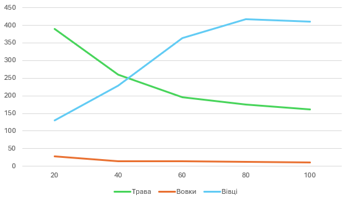

## Комп'ютерні системи імітаційного моделювання
## СПм-23-3, **Соболь Олег Русланович**
### Лабораторна робота №**2**. Редагування імітаційних моделей у середовищі NetLogo

 

### Варіант 7, модель у середовищі NetLogo:
[Wolf Sheep Predation](http://www.netlogoweb.org/launch#http://www.netlogoweb.org/assets/modelslib/Sample%20Models/Biology/Wolf%20Sheep%20Predation.nlogo).

 

### Внесені зміни у вихідну логіку моделі, за варіантом:
**Прибрати "зграйність" вовків**.

Процедура для руху та оцінки оточення вовками. Перевіряючи оточення, та обирати напрямок руху виходячи з наявності вівець та відсутності інших вовків. Якщо немає іншої можливості – переміщається випадково. 
<pre>
to move-and-assess-surroundings
  let nearby-sheep sheep in-radius 1  
  let nearby-wolves wolves in-radius 1 
  
  if any? nearby-sheep [ 
    face one-of nearby-sheep ; Пересування до найближчої вівці
    fd 1
  ] else if not any? nearby-wolves [
    rt random 50  ; Випадкове відхилення при відсутності овець та вовків
    lt random 50
    fd 1
  ] else [
    fd random 2  ; Якщо немає іншої можливості – переміщається випадково
  ]
  handle-wolf-collision  ; Ситуація, коли на одній ділянці поля два вовки
end
</pre>

**Обробка ситуації (колізії), вовків на одній ділянці поля**
<pre>
to handle-wolf-collision
  if any? other wolves-here [
    let other-wolf one-of other wolves-here  ; Вибір іншого вовка на цій клітинці
    ask other-wolf [ die ]  ; Видалення одного вовка
  ]
end
</pre>

**Процедура зміни напрямку овець**. 

При виявленні вовка на одній із клітин поруч змінюють напрямок на протилежний.
<pre>
to change-direction-if-near-wolf
  let nearby-wolves wolves in-radius 1
  if any? nearby-wolves [
    face one-of nearby-wolves  ; повернуться к ближайшему волку
    rt 180  ; изменить направление на противоположное
    fd 1
  ]
end
</pre>

### Внесені зміни у вихідну логіку моделі, на власний розсуд:
**Вовки оцінюють рівні енергії**.

Вовки тепер приймають рішення про пересування не лише на основі наявності овець або інших вовків, але й враховують свій рівень енергії. Якщо енергія низька, вони агресивніше шукають їжу (овець).
<pre>
  ; Якщо енергія низька, вовки активно шукають овець
  if energy < wolf-gain-from-food [ 
    --
  ]
  if energy >= wolf-gain-from-food [
    fd random 2 ; Звичайна поведінка за нормального рівня енергії
  ]

</pre>
<pre>
to move-and-assess-surroundings 
  let nearby-sheep sheep in-radius 1
  let nearby-wolves wolves in-radius 1
  
  if energy < wolf-gain-from-food [
    if any? nearby-sheep [
      face one-of nearby-sheep ; Пересування до найближчої вівці
      fd 1
    ]
    if not any? nearby-sheep and not any? nearby-wolves [
      rt random 50 ; Випадкове відхилення при відсутності овець та вовків
      lt random 50
      fd 1
    ]
    if not any? nearby-sheep and any? nearby-wolves [
      fd random 2 ; Якщо немає іншої можливості – переміщається випадково
    ]
  ]
  if energy >= wolf-gain-from-food [
    fd random 2 ; Звичайна поведінка за нормального рівня енергії
  ]
              
  handle-wolf-collision ; Ситуація, коли на одній ділянці поля два вовки
end
</pre>

**Вівці стають менш передбачуваними**.

Щоб уникнути надмірної передбачуваності в русі овець при наближенні вовка, вони змінюють напрямок випадковим чином (у межах 90-180 градусів), а не завжди на 180 градусів.
<pre>
to change-direction-if-near-wolf  
  if any? wolves in-radius 1 [
    rt random 90 + 90  ; Змінено кут повороту для більшої непередбачуваності
    fd 1
  ]
end
</pre>

**Енергетичний рівень впливає на народжуваність**.

Тепер і вівці, і вовки можуть розмножуватись лише за достатнього рівня енергії, що унеможливлює перевищення популяції за межі ресурсоємності моделі.
<pre>
to reproduce-sheep  
  if energy > 2 * sheep-gain-from-food and random-float 100 < sheep-reproduce [ ; Умова на енергію
    set energy (energy / 2)
    hatch 1 [ rt random-float 360 fd 1 ]
  ]
end

to reproduce-wolves  
  if energy > 2 * wolf-gain-from-food and random-float 100 < wolf-reproduce [ ; Умова на енергію
    set energy (energy / 2)
    hatch 1 [ rt random-float 360 fd 1 ]
  ]
end
</pre>

Фінальний код моделі та її інтерфейс доступні за [посиланням](Wolf_Sheep_Predation.nlogo).
 

## Обчислювальні експерименти 
### 1. Вплив часу відростання трави на популяції тварин
Досліджується залежність популяцій тварин від часу відростання трави протягом певної кількості кроків симуляції (50)
Експерименти проводяться при 20-100 часу відростання трави, з кроком 20, усього 5 симуляцій.  
Інші керуючі параметри мають значення за замовчуванням:
- **model-version** "sheep-wolves-grass"
- **initial-number-sheep** 100
- **initial-number-wolves** 50
- **sheep-gain-from-food** 4
- **wolf-gain-from-food** 20
- **sheep-reproduce** 4%
- **wolf-reproduce** 5%
- **show-energy?** off

<table>
<thead>
<tr><th>Час відростання трави</th><th>Трава</th><th>Вовки</th><th>Вівці</th></tr>
</thead>
<tbody>
<tr><td>20</td><td>389</td><td>28</td><td>130</td></tr>
<tr><td>40</td><td>260.5</td><td>14</td><td>229</td></tr>
<tr><td>60</td><td>196.5</td><td>15</td><td>364</td></tr>
<tr><td>80</td><td>174.25</td><td>13</td><td>417</td></tr>
<tr><td>100</td><td>161.5</td><td>11</td><td>411</td></tr>
</tbody>
</table>

Графік наочно показує, що: 
1) Час відростання трави суттєво впливає на чисельність популяцій трави, вовків та овець.
2) При збільшенні часу відростання трави зменшується загальна кількість трави, що стає обмежувальним фактором для популяцій.
3) Найнижча кількість вовків (11) зафіксована при максимальному часі відростання трави (100 одиниць), що вказує на їх залежність від популяції овець, яка, у свою чергу, залежить від трави.
4) Популяція овець зростає зі збільшенням часу відростання трави, досягаючи максимуму (417) при 80 одиницях часу, але дещо знижується при подальшому зростанні часу відростання.

Таким чином, для стабільного співіснування обох видів необхідний баланс між часом відростання трави та доступністю ресурсів для кожного виду.

## Відповіді на контрольні запитання
**1) Які підходи у рамках імітаційного моделювання вам відомі?**

- Агентно-орієнтоване моделювання (АОМ);
- Системно-динамічне моделювання (СДМ);
- Імітаційне моделювання подій (АВМ).

**2) Види агентів у середовищі NetLogo. // далі всі питання - у контексті синтаксису середовища мультиагентного моделювання NetLogo.**

- Turtles — активні агенти, що рухаються і виконують дії;
- Patches — нерухомі елементи поля, що мають власні властивості;
- Links — зв’язки між агентами (turtles), що використовуються для побудови мереж.

**3) Як створити процедуру та функцію?**

&nbsp;&nbsp;&nbsp;&nbsp;&nbsp;Процедури створюються за допомогою команди to ... end; 
&nbsp;&nbsp;&nbsp;&nbsp;&nbsp;Функції створюються як постійні процедури через конструкцію to-report ... end.

**4) Як вивести повідомлення користувачеві?**

- Використовується команда user-message;
- Команда print (для виводу в консоль);
- Команда show (для виводу в інтерфейс).

**5) Як встановити значення змінної?**

- Локальні змінні створюються командою let; 
- Глобальні змінні оголошуються у блоці globals. 
&nbsp;&nbsp;&nbsp;&nbsp;&nbsp;globals [global-var] 
&nbsp;&nbsp;&nbsp;&nbsp;&nbsp;set global-var 20

**6) Як реалізуються цикли?**

- Цикл repeat; 
&nbsp;&nbsp;&nbsp;&nbsp;&nbsp;repeat n [ print "Hello" ]
- Цикл while; 
&nbsp;&nbsp;&nbsp;&nbsp;&nbsp;while [condition] [ ; дії ]
- Цикл foreach. 
&nbsp;&nbsp;&nbsp;&nbsp;&nbsp;foreach [1 2 3] [ print ? ]

**7) Що описується у turtles-own та globals?**

&nbsp;&nbsp;&nbsp;&nbsp;&nbsp;turtles-own — визначення властивостей для кожного агента (turtle); 
&nbsp;&nbsp;&nbsp;&nbsp;&nbsp;globals — оголошення глобальних змінних для моделі.

**8) Навіщо використовується конструкція ask?**

&nbsp;&nbsp;&nbsp;&nbsp;&nbsp;Для виконання дій групою агентів (turtles, patches, links). Для виклику команд або встановлення значень змінних для певних агентів чи груп агентів.

**9) Як створити активних агентів? Які їх властивості доступні на початковому етапі? Як ідентифікувати агента? Як видалити агента з поля?**

&nbsp;&nbsp;&nbsp;&nbsp;&nbsp;Використовується команда create-turtles 
&nbsp;&nbsp;&nbsp;&nbsp;&nbsp;&nbsp;&nbsp;create-turtles 10 [ set color green ] 
&nbsp;&nbsp;&nbsp;&nbsp;&nbsp;Властивості на початку: позиція, колір (білий за замовчуванням), форма; 
&nbsp;&nbsp;&nbsp;&nbsp;&nbsp;Ідентифікація агента: через who (унікальний номер агента); 
&nbsp;&nbsp;&nbsp;&nbsp;&nbsp;Видалення агента: команда die.

**10) Як створити різнорідних активних агентів?**

&nbsp;&nbsp;&nbsp;&nbsp;&nbsp;Застосовуються породження видів через breeds. 
&nbsp;&nbsp;&nbsp;&nbsp;&nbsp;&nbsp;&nbsp;breeds [wolves sheep]

**11) Навіщо використовується конструкція hatch?**

&nbsp;&nbsp;&nbsp;&nbsp;&nbsp;Для створення нового агента з властивостями "батьківського" агента.

**12) Які команди використовують для переміщення агентів? Як визначається напрямок переміщення?**

&nbsp;&nbsp;&nbsp;&nbsp;&nbsp;fd, bk, lt, rt для руху вперед, назад, ліворуч, праворуч. Напрямок визначається командами set heading або face.

**13) У чому різниця між random-pxcor та random-xcor?**

&nbsp;&nbsp;&nbsp;&nbsp;&nbsp;random-pxcor генерує випадкову координату серед патчів; 
&nbsp;&nbsp;&nbsp;&nbsp;&nbsp;random-xcor генерує випадкову координату в континуумі (може бути дробовою).

**14) Як встановити колір для ділянки імітаційного поля?**

&nbsp;&nbsp;&nbsp;&nbsp;&nbsp;Використовується команда set pcolor; 
&nbsp;&nbsp;&nbsp;&nbsp;&nbsp;&nbsp;&nbsp;ask patches [ set pcolor red ]

**15) Як визначити наявність агента в ділянці поля за курсом руху агента?**

&nbsp;&nbsp;&nbsp;&nbsp;&nbsp;ask patches at-points [ [ xcor ] of точка [ ycor ] of точка ] of turtles [ ... ]

**16) Як отримати випадкове число у заданому діапазоні?**

&nbsp;&nbsp;&nbsp;&nbsp;&nbsp;Використовується random для цілих або random-float для дробових чисел.

**17) У чому різниця при використанні конструкцій one-of та n-of?**

&nbsp;&nbsp;&nbsp;&nbsp;&nbsp;one-of вибирає один випадковий елемент зі списку; 
&nbsp;&nbsp;&nbsp;&nbsp;&nbsp;n-of вибирає кілька випадкових елементів зі списку.

**18) Для чого використовується конструкція item?**

&nbsp;&nbsp;&nbsp;&nbsp;&nbsp;Для доступу до елемента списку за індексом.

**19) Як вивести користувачеві поточну кількість активних агентів на полі?**

&nbsp;&nbsp;&nbsp;&nbsp;&nbsp;Використовується команда count. 
&nbsp;&nbsp;&nbsp;&nbsp;&nbsp;&nbsp;&nbsp;user-message (word "Кількість агентів: " count turtles)

**20) Як відбувається перехід до наступного такту модельного часу?**

&nbsp;&nbsp;&nbsp;&nbsp;&nbsp;Перехід здійснюється командою tick.
