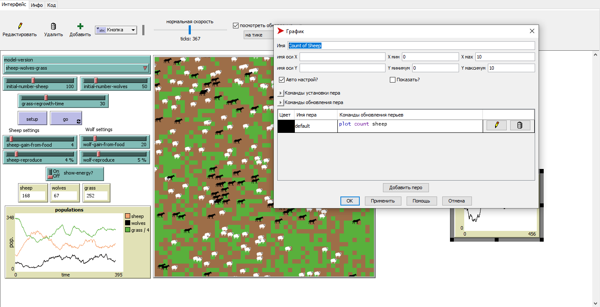
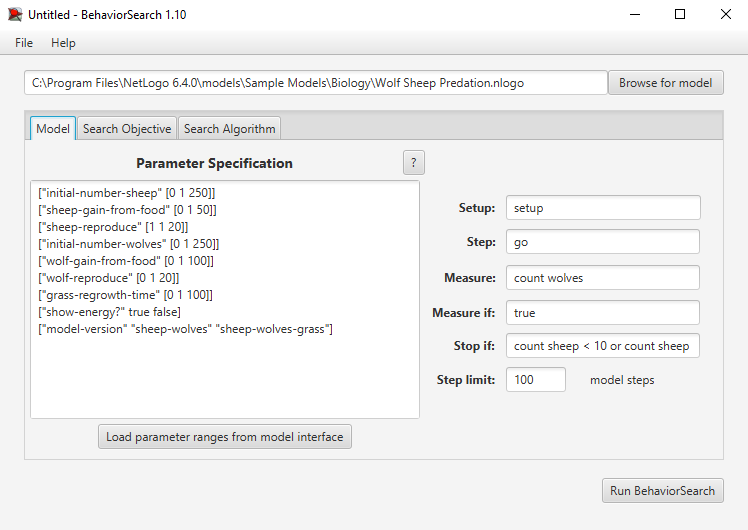
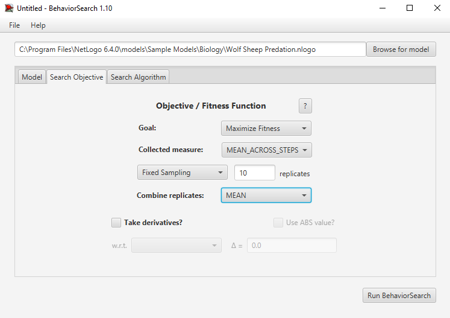
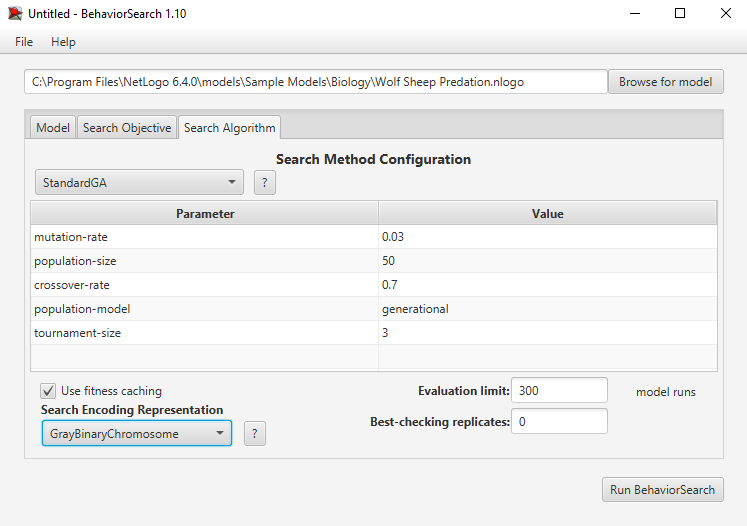
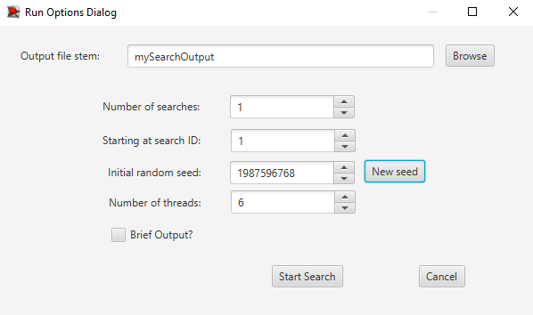
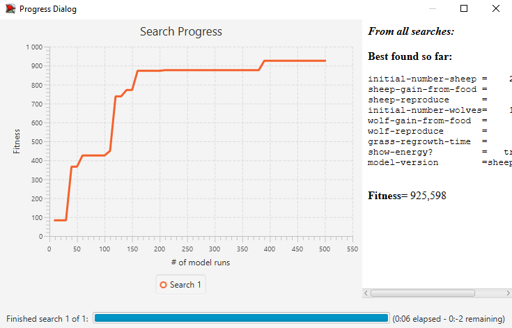

## Комп'ютерні системи імітаційного моделювання
## СПм-23-3, **Соболь Олег Русланович**
### Лабораторна робота №**3**. Використання засобів обчислювального интелекту для оптимізації імітаційних моделей

 

### Варіант 7, модель у середовищі NetLogo:
[Wolf Sheep Predation](http://www.netlogoweb.org/launch#http://www.netlogoweb.org/assets/modelslib/Sample%20Models/Biology/Wolf%20Sheep%20Predation.nlogo).

 

### Вербальний опис моделі:

Опис моделі був зроблений у [першій лабораторній роботі](https://github.com/olehso/KSIM_Labs/blob/main/Lab_1/README.md).

### Налаштування середовища BehaviorSearch:

**Обрана модель**:
<pre>
C:\Program Files\NetLogo 6.4.0\models\Sample Models\Biology\Wolf Sheep Predation.nlogo
</pre>
**Параметри моделі** (вкладка Model):  
<pre>
["initial-number-sheep" [0 1 250]]
["sheep-gain-from-food" [0 1 50]]
["sheep-reproduce" [1 1 20]]
["initial-number-wolves" [0 1 250]]
["wolf-gain-from-food" [0 1 100]]
["wolf-reproduce" [0 1 20]]
["grass-regrowth-time" [0 1 100]]
["show-energy?" true false]
["model-version" "sheep-wolves" "sheep-wolves-grass"]
</pre>
Використовувана **міра**:  
Для фітнес-функції було обрано **значення кількості овець**, вираз для її розрахунку взято з налаштувань графіка аналізованої імітаційної моделі в середовищі NetLogo.

  
та вказано у параметрі "**Measure**":
<pre>
count wolves
</pre>
Параметр зупинки за умовою ("**Stop if**") налаштований так, щоб симуляція припинялася, коли кількість овець стає меншою за 10 або перевищує 2000, щоб уникнути надмірного навантаження на ПК.
<pre>
count sheep < 10 or count sheep > 2000
</pre>

Загальний вигляд вкладки налаштувань параметрів моделі:

**Налаштування цільової функції** (вкладка Search Objective):
Метою підбору параметрів імітаційної моделі, є **максимізація** значення кількості овець на полі – це вказано через параметр "**Goal**" зі значенням **Maximize Fitness**. Тобто необхідно визначити такі параметри налаштувань моделі, у яких виживає максимальна кількість овець. Для цього у параметрі "**Collected measure**", що визначає спосіб обліку значень обраного показника, вказано **MEAN_ACROSS_STEPS**. Для запобігання спотворенню результатів через випадкові значення, що застосовуються в логіці імітаційної моделі, **кожну симуляцію виконують 10 разів**.

Загальний вигляд вкладки налаштувань цільової функції:  

**Налаштування алгоритму пошуку** (вкладка Search Algorithm):  
Загальний вид вкладки налаштувань алгоритму пошуку: 

 

### Результати використання BehaviorSearch:
Діалогове вікно запуску пошуку 

Результат пошуку параметрів імітаційної моделі, використовуючи **генетичний алгоритм**:

Результат пошуку параметрів імітаційної моделі, використовуючи **випадковий пошук**:

 

## Відповіді на контрольні запитання
**1) Навіщо потрібна оптимізаційна модель?**

&nbsp;&nbsp;&nbsp;&nbsp;&nbsp;Для пошуку найкращих параметрів системи, які забезпечують максимальну продуктивність або мінімізують витрати. Вона допомагає налаштовувати моделі, щоб отримати бажані результати за певними критеріями.

**2) Які етапи використання середовища BehaviorSearch?**

- Завантаження імітаційної моделі NetLogo;
- Визначення параметрів, які підлягають оптимізації;
- Налаштування цільової функції (функції пристосованості);
- Визначення методу пошуку (наприклад, генетичний алгоритм або випадковий пошук);
- Встановлення критеріїв зупинки;
- Проведення пошуку та аналіз отриманих результатів.

**3) Що таке цільова функція (функція пристосованості)?**

&nbsp;&nbsp;&nbsp;&nbsp;&nbsp;Це математичний вираз або алгоритм, який визначає, наскільки добре певний набір параметрів відповідає меті оптимізації. Вона використовується для оцінки кожного варіанту рішень у процесі пошуку.

**4) Як ви розумієте поняття "простору пошуку"?**

&nbsp;&nbsp;&nbsp;&nbsp;&nbsp;Це множина всіх можливих значень параметрів, які можуть бути випробувані під час оптимізації. Простір пошуку визначає обмеження для варіантів рішень.

**5) Які алгоритми пошуку доступні у середовищі BehaviorSearch?**

- Генетичний алгоритм;
- Випадковий пошук (Random Search);
- Імітація відпалу (Simulated Annealing);
- Метод сходження до вершини (Hill Climbing).

**6) У чому полягає метод випадкового пошуку?**

&nbsp;&nbsp;&nbsp;&nbsp;&nbsp;Метод випадкового пошуку полягає у випадковій генерації наборів параметрів у просторі пошуку та оцінці їх якості за допомогою цільової функції. Це простий метод, але він може бути неефективним для складних просторів.

**7) У чому різниця між середнім арифметичним значенням та медіаною?**

&nbsp;&nbsp;&nbsp;&nbsp;&nbsp;Середнє арифметичне — сума всіх значень, поділена на їх кількість. 
&nbsp;&nbsp;&nbsp;&nbsp;&nbsp;Медіана — значення, яке знаходиться посередині впорядкованого списку, якщо кількість значень непарна, або середнє двох середніх значень, якщо кількість парна.

**8) Які можуть використовуватися критерії зупинки пошуку?**

- Досягнення максимального числа ітерацій;
- Відсутність покращення результатів за певну кількість кроків;
- Досягнення заданого значення цільової функції;
- Вичерпання часу пошуку.

**9) Які основні етапи роботи генетичного алгоритму?**

- Ініціалізація популяції;
- Оцінка пристосованості (використання цільової функції);
- Відбір особин для відтворення;
- Генетичні операції (кросовер, мутація);
- Формування нової популяції;
- Перевірка критеріїв зупинки.

**10) Які генетичні оператори вам відомі?**

&nbsp;&nbsp;&nbsp;&nbsp;&nbsp;Кросовер (схрещування): комбінування генів двох батьків для створення нових особин. 
&nbsp;&nbsp;&nbsp;&nbsp;&nbsp;Мутація: випадкові зміни генів для введення нових варіантів у популяцію. 
&nbsp;&nbsp;&nbsp;&nbsp;&nbsp;Селекція: вибір найбільш пристосованих особин для наступного покоління.

**11) Що таке кросовер? Як відбувається відбір особин для нього?**

&nbsp;&nbsp;&nbsp;&nbsp;&nbsp;Кросовер — процес комбінування генетичного матеріалу двох "батьків" для створення "нащадків". 
&nbsp;&nbsp;&nbsp;&nbsp;&nbsp;Відбір для кросовера зазвичай проводиться методами: 
&nbsp;&nbsp;&nbsp;&nbsp;&nbsp;&nbsp;&nbsp;__Рулетка:__ ймовірність відбору пропорційна пристосованості. 
&nbsp;&nbsp;&nbsp;&nbsp;&nbsp;&nbsp;&nbsp;__Турнірний відбір:__ випадковий вибір групи особин і відбір найкращої з них.

**12) Навіщо потрібен оператор мутації?**

&nbsp;&nbsp;&nbsp;&nbsp;&nbsp;Для введення нових генетичних варіацій, що допомагає уникати локальних оптимумів і покращувати дослідження простору пошуку.

**13) Які є способи кодування варіантів рішень (особин) у генетичному алгоритмі?**

- Бінарне кодування: параметри представляються у вигляді бінарних рядків.
- Дійсне кодування: параметри представлені у вигляді дійсних чисел.
- Символьне кодування: використання символів для представлення параметрів.

**14) Недоліки та переваги використання генетичних алгоритмів.**

&nbsp;&nbsp;&nbsp;&nbsp;&nbsp;Недоліки: Велика обчислювальна складність. Потреба в тонкому налаштуванні параметрів. Можливість затримки у локальних оптимумах. 
&nbsp;&nbsp;&nbsp;&nbsp;&nbsp;Переваги: Ефективний для складних просторів пошуку. Може знаходити глобальні оптимуми. Гнучкість у застосуванні.

**15) У чому полягає алгоритм імітації відпалу?**

&nbsp;&nbsp;&nbsp;&nbsp;&nbsp;Це метод оптимізації, що імітує процес охолодження металу. Алгоритм поступово зменшує ймовірність прийняття гірших рішень, дозволяючи уникати локальних оптимумів на ранніх етапах.

**16) У чому полягає метод пошуку сходженням до вершини?**

&nbsp;&nbsp;&nbsp;&nbsp;&nbsp;Метод покращує поточне рішення, шукаючи його локальне оточення, і обирає найкраще. Він може швидко знайти локальний оптимум, але часто застрягає в ньому.
