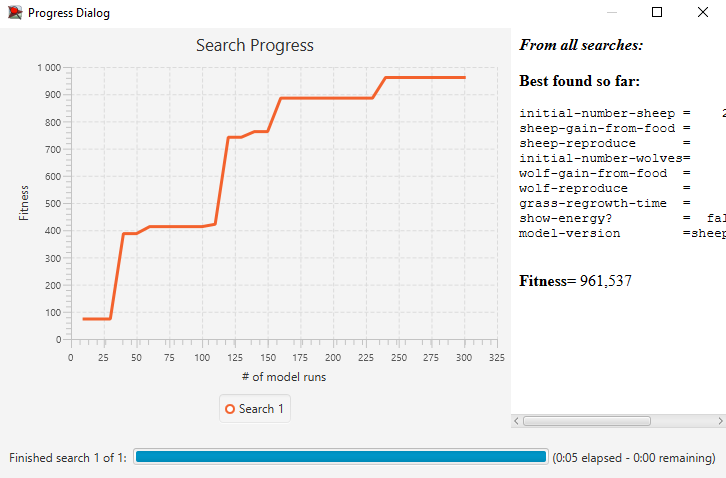

## Комп'ютерні системи імітаційного моделювання
## СПм-23-3, **Соболь Олег Русланович**
### Лабораторна робота №**3**. Використання засобів обчислювального интелекту для оптимізації імітаційних моделей

 

### Варіант 7, модель у середовищі NetLogo:
[Wolf Sheep Predation](http://www.netlogoweb.org/launch#http://www.netlogoweb.org/assets/modelslib/Sample%20Models/Biology/Wolf%20Sheep%20Predation.nlogo).

 

### Вербальний опис моделі:

Опис моделі був зроблений у [першій лабораторній роботі](https://github.com/olehso/KSIM_Labs/blob/main/Lab_1/README.md).

### Налаштування середовища BehaviorSearch:

**Обрана модель**:
<pre>
C:\Program Files\NetLogo 6.4.0\models\Sample Models\Biology\Wolf Sheep Predation.nlogo
</pre>
**Параметри моделі** (вкладка Model):  
<pre>
["initial-number-sheep" [0 1 250]]
["sheep-gain-from-food" [0 1 50]]
["sheep-reproduce" [1 1 20]]
["initial-number-wolves" [0 1 250]]
["wolf-gain-from-food" [0 1 100]]
["wolf-reproduce" [0 1 20]]
["grass-regrowth-time" [0 1 100]]
["show-energy?" true false]
["model-version" "sheep-wolves" "sheep-wolves-grass"]
</pre>
Використовувана **міра**:  
Для фітнес-функції було обрано **значення кількості вовків**, вираз для її розрахунку взято з налаштувань графіка аналізованої імітаційної моделі в середовищі NetLogo.

  
та вказано у параметрі "**Measure**":
<pre>
count wolves
</pre>
Параметр зупинки за умовою ("**Stop if**") налаштований так, щоб симуляція припинялася, коли кількість овець стає меншою за 10 або перевищує 2000, щоб уникнути надмірного навантаження на ПК.
<pre>
count sheep < 10 or count sheep > 2000
</pre>

Загальний вигляд вкладки налаштувань параметрів моделі:

**Налаштування цільової функції** (вкладка Search Objective):
Метою підбору параметрів імітаційної моделі, є **максимізація** значення кількості вовків на полі – це вказано через параметр "**Goal**" зі значенням **Maximize Fitness**. Тобто необхідно визначити такі параметри налаштувань моделі, у яких виживає максимальні кількість вовків. Для цього у параметрі "**Collected measure**", що визначає спосіб обліку значень обраного показника, вказано **MEAN_ACROSS_STEPS**. Для запобігання спотворенню результатів через випадкові значення, що застосовуються в логіці імітаційної моделі, **кожну симуляцію виконують 10 разів**.

Загальний вигляд вкладки налаштувань цільової функції:  

**Налаштування алгоритму пошуку** (вкладка Search Algorithm):  
Загальний вид вкладки налаштувань алгоритму пошуку: 

 

### Результати використання BehaviorSearch:
Діалогове вікно запуску пошуку 

Результат пошуку параметрів імітаційної моделі, використовуючи **генетичний алгоритм**:

Результат пошуку параметрів імітаційної моделі, використовуючи **випадковий пошук**:

 
